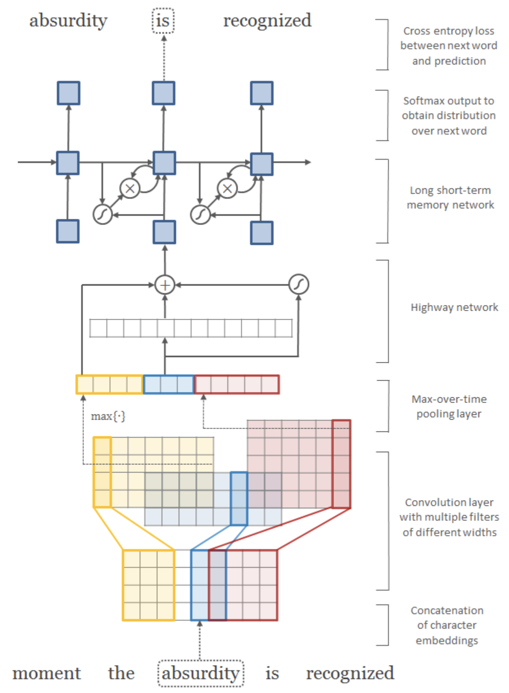

# CharLM
PyTorch implementation of [Character-Aware Neural Language Models](https://arxiv.org/abs/1508.06615)


[](https://codecov.io/gh/HephaestusProject/template)
[](https://github.com/psf/black)

## Abstract

A simple neural language model that relies only on character-level inputs.
Predictions are still made at the word-level.
This model employs a convolutional neural network (CNN) and a highway network over characters, 
whose output is given to a long short-term memory (LSTM) recurrent neural network language model (RNN-LM). 



## Performance
Performance of our implementation versus other implementations on the **English Penn Treebank** test set.

| Implementation | Framework | test perplexity |
| -------------- | --------- | --------------- |
| [Original paper](https://github.com/yoonkim/lstm-char-cnn) | Torch (Lua) | 78.9 |
| dreamgonfly (ours) | PyTorch | 96.3 |
| [jarfo](https://github.com/jarfo/kchar) | Keras | 79 |
| [seongjunyun](seongjunyun/Character-Aware-Neural-Language-Models) | PyTorch | 89.69 |
| [FengZiYjun](https://github.com/FengZiYjun/CharLM) | PyTorch | 127.2 |

## Open API
Try it yourself!

https://charlm.monthly-deeplearning.io/docs

## Training
Train it yourself!

* Docker build
```
docker build . --file charlm-trainer.Dockerfile --tag charlm-trainer:v0.1 --rm
```
* Docker run
```
docker run --interactive --tty --name clm --gpus all --shm-size 4G --volume /home/{username}/pytorch-CharLM:/charlm charlm-trainer:v0.1
```
* Train
```
CUDA_VISIBLE_DEVICES=0 python main.py train --train-val-dir data/ptb --train-path train.txt --val-path valid.txt --word-vocabulary-path tokenizers/data/word_vocabulary.tsv --char-vocabulary-path tokenizers/data/char_vocabulary.tsv --max-word-length 65 --sequence-length 35 --char-embedding-dim 15 --char-conv-kernel-sizes '1,2,3,4,5,6' --char-conv-out-channels '25,50,75,100,125,150' --hidden-dim 300 --num-highway-layers 1 --use-batch-norm --dropout 0.5 --gradient-clip-val 5.0 --lr 1.0 --batch-size 20 --num-workers 4 --max-epochs 25
```

* Test
```
CUDA_VISIBLE_DEVICES=0 python main.py test --test-path data/ptb/test.txt --word-vocabulary-path tokenizers/data/word_vocabulary.tsv --char-vocabulary-path tokenizers/data/char_vocabulary.tsv --max-word-length 65 --sequence-length 35 --checkpoint-path results/runs/run/v071/checkpoints/epoch\=024_val_ppl\=81.84527.ckpt
```

### Project structure

```
├── LICENSE
├── README.md
├── batch_sampler.py
├── build_vocabulary.py
├── charlm-server.Dockerfile
├── charlm-trainer.Dockerfile
├── checkpoints
│   └── epoch=024_val_ppl=101.52542.ckpt
├── configs
│   └── deploying
│       └── latest.yaml
├── data
│   └── ptb
│       ├── test.txt
│       ├── train.txt
│       └── valid.txt
├── dataset.py
├── deploying
│   └── helm
│       ├── Chart.yaml
│       ├── templates
│       │   ├── deployment.yaml
│       │   └── service.yaml
│       └── values.yaml
├── download_ptb.sh
├── lightning_dataloader.py
├── lightning_model.py
├── losses.py
├── main.py
├── metrics.py
├── model.py
├── predictor.py
├── pyproject.toml
├── requirements.txt
├── resources
│   └── architecture.png
├── server.py
├── serving
│   └── app_factory.py
├── test.py
├── tests
│   ├── __init__.py
│   ├── data
│   │   ├── sample.txt
│   │   ├── sample_char_vocabulary.tsv
│   │   └── sample_word_vocabulary.tsv
│   ├── test_dataset.py
│   ├── test_loss.py
│   ├── test_model.py
│   ├── test_predictor.py
│   ├── test_server.py
│   └── test_tokenizers.py
├── tokenizers
│   ├── __init__.py
│   ├── char_tokenizer.py
│   ├── data
│   │   ├── char_vocabulary.tsv
│   │   └── word_vocabulary.tsv
│   └── word_tokenizer.py
├── train.py
└── utils.py
```
31 directories, 75 files

### License

* Licensed under an MIT license.
